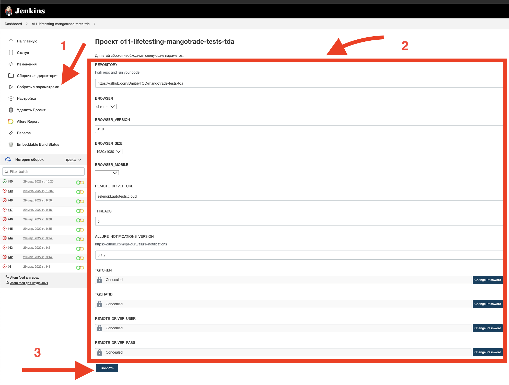
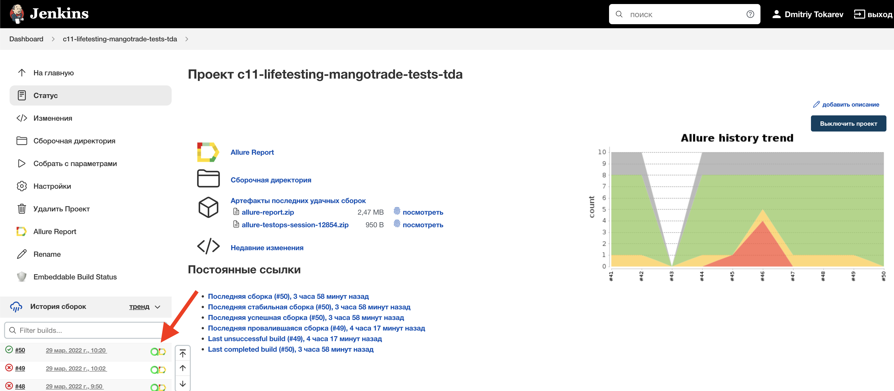
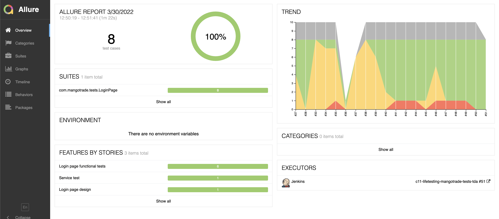
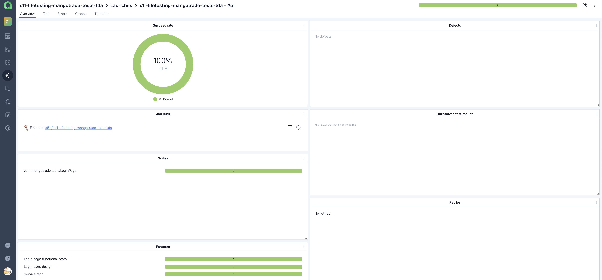
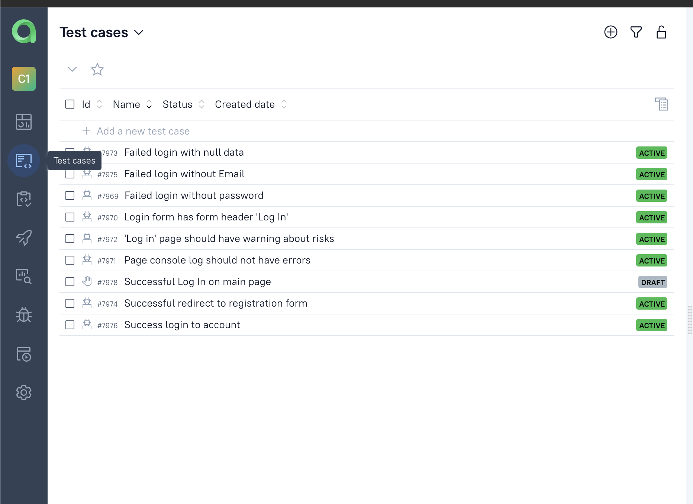
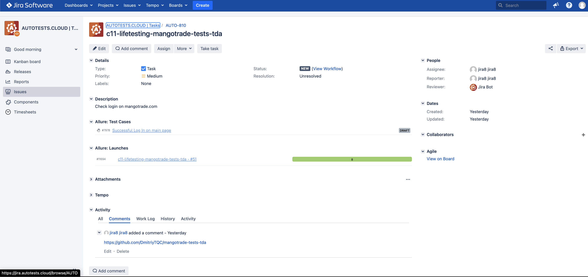
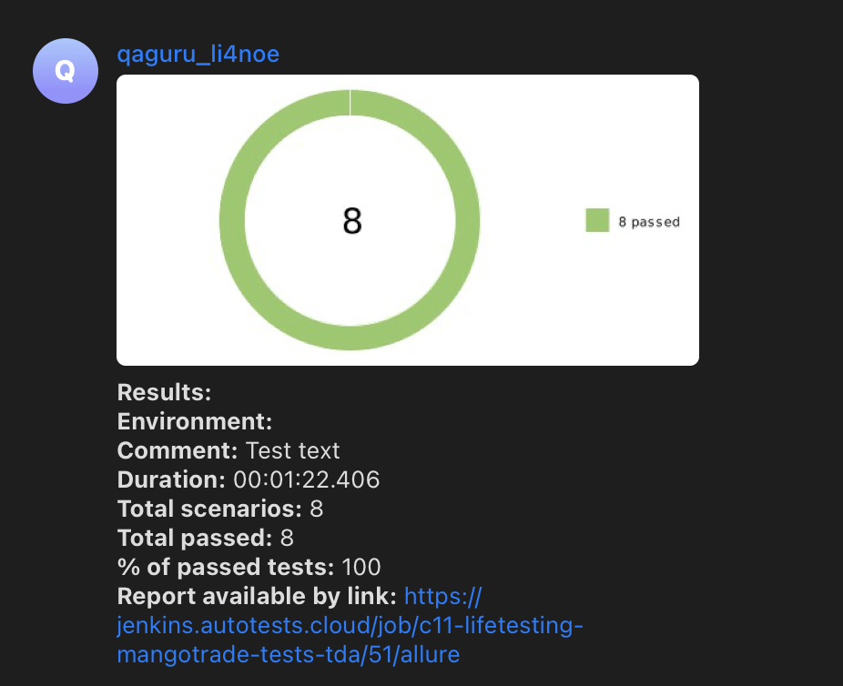

<a href="https://mangotrade.com"></a>

# Automation project for [MangoTrade.com](mangotrade.com)
## :bulb: Content:

- [Implemented automated checks](##Implemented-automated-checks)
- [Implemented manual checks](##Implemented-manual-checks)
- [Scheduled to automate checks](##Scheduled-to-automate-checks)
- [Technology stack](##Technology-stack)
- [Tests launch from Terminal](##Tests-launch-from-Terminal)
- [Tests launch from Jenkins](#Tests-launch-from-Jenkins#)
- [Tests results report in Allure Report](#Tests-results-report-in-Allure-Report)
- [Allure TestOps integration](#Allure-TestOps-integration)
- [Jira integration](#Jira-integration)
- [Telegram notifications using a bot](#Telegram-notifications-using-a-bot)
- [Example of test execution in Selenoid](#Example-of-test-execution-in-    Selenoid)
___

## :white_check_mark: Implemented automated checks
- [x] Success login to account
- [x] Failed login with null data
- [x] Failed login without Email
- [x] Failed login without Password
- [x] Login form has form header 'Log In'
- [x] 'Log in' page should have warning about risks
- [x] Page console log should not have errors
- [x] Successful redirect to registration form

## :hand: Implemented manual checks
- [x] Success login to account by widget on main page

## :soon: Scheduled to automate checks
- [ ] api login checks
- [ ] logut checks
- [ ] switch language api checks

## :gear: Technology stack
<p align="center">
<a href="https://www.jetbrains.com/idea/"></a>
<a href="https://www.java.com/"></a>
<a href="https://github.com/"></a>
<a href="https://junit.org/junit5/"></a>
<a href="https://gradle.org/"></a>
<a href="https://selenide.org/"></a>
<a href="https://aerokube.com/selenoid/"></a>
<a href="https://github.com/allure-framework/allure2"></a>
<a href="https://qameta.io/"></a>
<a href="https://www.jenkins.io/"></a>
<a href="https://telegram.org/?setln=en/"></a>
</p>

Current project is developing and it contains autotests written by <code>Java</code> with using code>Selenide</code> for UI-tests.
В данном проекте автотесты написаны на <code>Java</code> с использованием <code>Selenide</code> для UI-тестов.
>
> <code>Selenoid</code> executes browsers launch in containers <code>Docker</code>.
> <code>Selenoid</code> выполняет запуск браузеров в контейнерах <code>Docker</code>.
>
> <code>Allure Report</code> и <code>Allure TestOps</code> generate reports and graphs about tests launh,
> also them enable possibility to store and to track manual tests, which will be automated in the future.
> <code>Allure Report</code> и <code>Allure TestOps</code> формируют отчеты и графики о запуске тестов, а также
> возможность хранения и отслежтвания ручных тестов, которые в дальнейшем также могут быть автоматизирвоаны.
>
> For automated project builds is used <code>Gradle</code>.
> Для автоматизированной сборки проекта используется <code>Gradle</code>.
>
> As unit test library  is used <code>JUnit 5</code>.
> В качестве библиотеки для модульного тестирования используется <code>JUnit 5</code>.
>
>  <code>Jenkins</code> executes launch of tests.
> <code>Jenkins</code> выполняет запуск тестов.
> After ending of a test run, notifications are sent by <code>Telegram</code> bot.
> После завершения прогона отправляются уведомления с помощью бота в <code>Telegram</code>.


##  Tests launch from Terminal

### :wrench: Local tests launch

```
gradle clean test
```

### :hammer_and_wrench:	 Remote tests launch

```
clean
test
-Dbrowser=${BROWSER}
-DbrowserVersion=${BROWSER_VERSION}
-DbrowserSize=${BROWSER_SIZE}
-DbrowserMobileView="${BROWSER_MOBILE}"
-DremoteDriverUrl=https://${REMOTE_DRIVER_USER}:${REMOTE_DRIVER_PASS}@${REMOTE_DRIVER_URL}/wd/hub/
-DvideoStorage=https://${REMOTE_DRIVER_URL}/video/
-Dthreads=${THREADS}
```

### :clipboard:	 Build settings

> <code>REMOTE_DRIVER_URL</code> – адрес удаленного сервера, на котором будут запускаться тесты.
> <code>REMOTE_DRIVER_URL</code> – remote server address, where tests will be launched.
> 
> REMOTE_DRIVER_USER, REMOTE_DRIVER_PASS - credits for remote server.
>
> <code>BROWSER</code> – browser, where test wil be executed (_default value: <code>chrome</code>_).
> <code>BROWSER</code> – браузер, в котором будут выполняться тесты (_по умолчанию - <code>chrome</code>_).
>
> <code>BROWSER_VERSION</code> – browser version, where test will be executed (_default value: <code>91.0</code>_).
> <code>BROWSER_VERSION</code> – версия браузера, в которой будут выполняться тесты (_по умолчанию - <code>91.0</code>_).
>
> <code>BROWSER_SIZE</code> – window size of browser, where test wil be executed (_default value: <code>1920x1080</code>_).
> <code>BROWSER_SIZE</code> – размер окна браузера, в котором будут выполняться тесты (_по умолчанию - <code>1920x1080</code>_).
> 
> <code>THREADS</code> - this setting gives possibility to launch specified number of tests in parallel.
> 
> <code>BROWSER_MOBILE</code> - mobile browser, where test will be executed (_default value: null)
> NOTE: this setting isn't used in current project, because mobile testing is the topic of future lessons

___
##  Tests launch from [Jenkins](https://jenkins.autotests.cloud/job/c11-lifetesting-mangotrade-tests-tda/)
*Для запуска сборки необходимо указать значения параметров и нажать кнопку <code><strong>*Собрать*</strong></code>.*
*For launch remote tests it's necessary to click the option <code><strong>*Собрать с параметрами*</strong></code>, then to fill build settings and click the button <code><strong>*Собрать*</strong></code>.*
<p align="center">
  
</p>

*После выполнения сборки, в блоке <code><strong>*История сборок*</strong></code> напротив номера сборки появится
значок <code><strong>*Allure
Report*</strong></code>, кликнув по которому, откроется страница с сформированным html-отчетом.*
*After tests execution, in the panel <code><strong>*История сборок*</strong></code> in the row with build number will be appeared
icons <code><strong>*Allure Report*</strong></code>
and <code><strong>*Allure TestOps*</strong></code>.
Icon <code><strong>*Allure Report*</strong></code> opens 
html-report in Allure Report.
Icon <code><strong>*Allure TestOps*</strong></code> opens
html-report in Allure TestOps.*

<p align="center">
  
</p>

##  Tests results report in [Allure Report](https://jenkins.autotests.cloud/job/c11-lifetesting-mangotrade-tests-tda/50/allure/)

### :pushpin: Common information

*Allure report main page contains next informations blocks:* 
*Главная страница Allure-отчета содержит следующие информационные блоки:*
> - [x] <code><strong>*ALLURE REPORT*</strong></code> -  date and time of tests launch, total number executed cases and the diagram with indicating of percentage and number successful, failed and broken tests
>- [x] <code><strong>*TREND*</strong></code> - displays trend of passing tests from one build to other
>- [x] <code><strong>*SUITES*</strong></code> - displays the distribution of tests results by tests suites
>- [x] <code><strong>*ENVIRONMENT*</strong></code> - displays test environment where tests were launched
>- [x] <code><strong>*CATEGORIES*</strong></code> - displays the distribution of failed tests by types of defects
>- [x] <code><strong>*FEATURES BY STORIES*</strong></code> - displays the distribution of tests by functionality, which they checks
>- [x] <code><strong>*EXECUTORS*</strong></code> - displays the executor of the current build (link to Jenkins build)
> 
>- [x] <code><strong>*ALLURE REPORT*</strong></code> - отображает дату и время прохождения теста, общее количество прогнанных кейсов, а также диаграмму с указанием процента и количества успешных, упавших и сломавшихся в процессе выполнения тестов
>- [x] <code><strong>*TREND*</strong></code> - отображает тренд прохождения тестов от сборки к сборке
>- [x] <code><strong>*SUITES*</strong></code> - отображает распределение результатов тестов по тестовым наборам
>- [x] <code><strong>*ENVIRONMENT*</strong></code> - отображает тестовое окружение, на котором запускались тесты (в данном случае информация не задана)
>- [x] <code><strong>*CATEGORIES*</strong></code> - отображает распределение неуспешно прошедших тестов по видам дефектов
>- [x] <code><strong>*FEATURES BY STORIES*</strong></code> - отображает распределение тестов по функционалу, который они проверяют
>- [x] <code><strong>*EXECUTORS*</strong></code> - отображает исполнителя текущей сборки (ссылка на сборку в Jenkins)

<p align="center">
  
</p>

##  [Allure TestOps](https://allure.autotests.cloud/launch/11665) integration

### :pushpin: Overview dashboard

<p align="center">
  
</p>

### :pushpin: Test cases

<p align="center">
  
</p>

##  [Jira](https://jira.autotests.cloud/browse/AUTO-810) integration

<p align="center">
  
</p>

##  Telegram notifications using a bot

> После завершения сборки специальный бот, созданный в <code>Telegram</code>, автоматически обрабатывает и отправляет сообщение с отчетом о прогоне тестов.
> After the test run is completed, created <code>Telegram</code>-bot automatically handles and sends a message with a test run report.   

<p align="center">

</p>

##  Example of test execution in Selenoid

> A video is attached to each test in the report.

