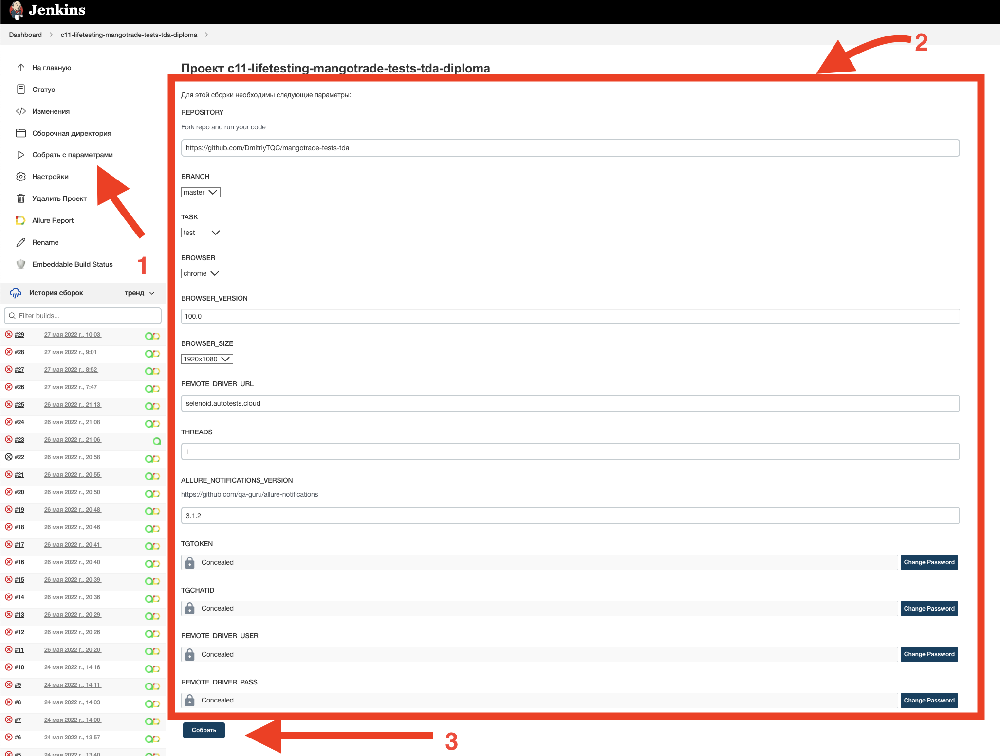
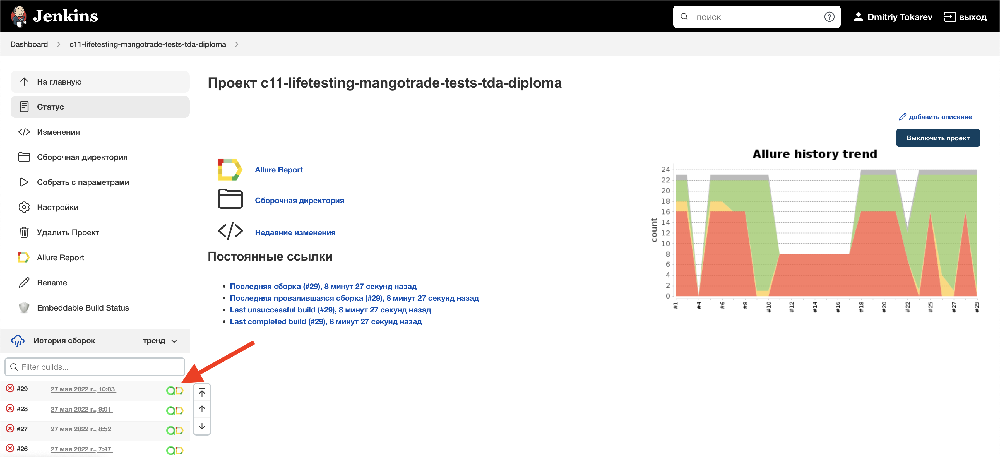
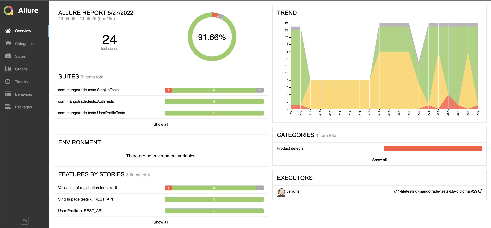
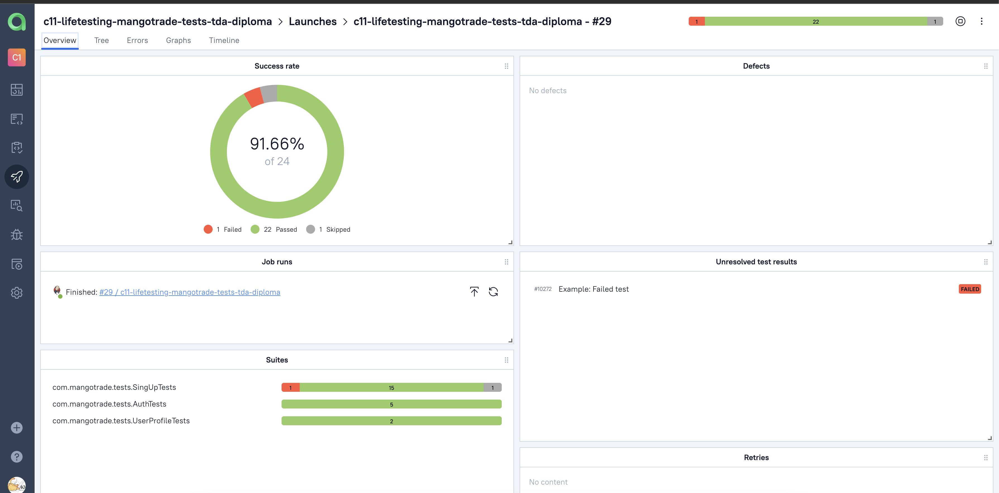
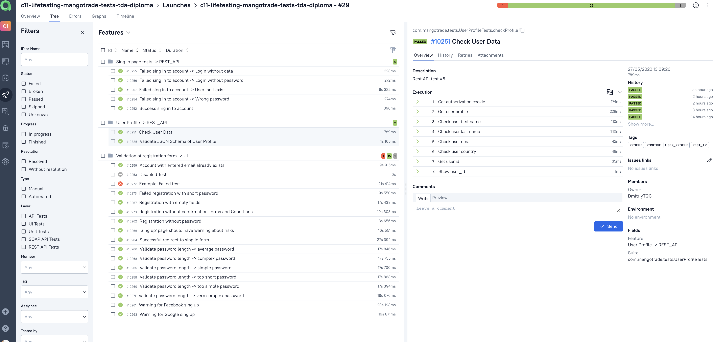
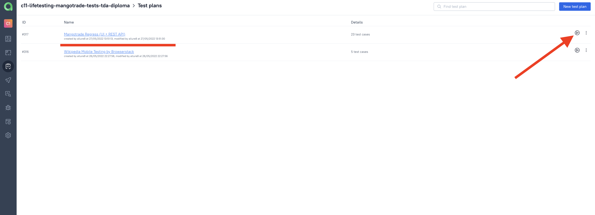
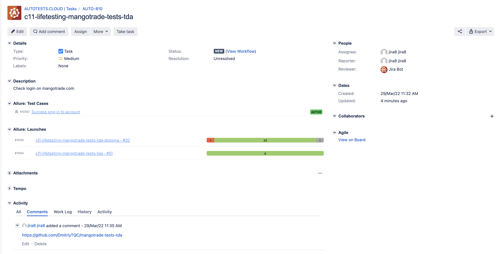
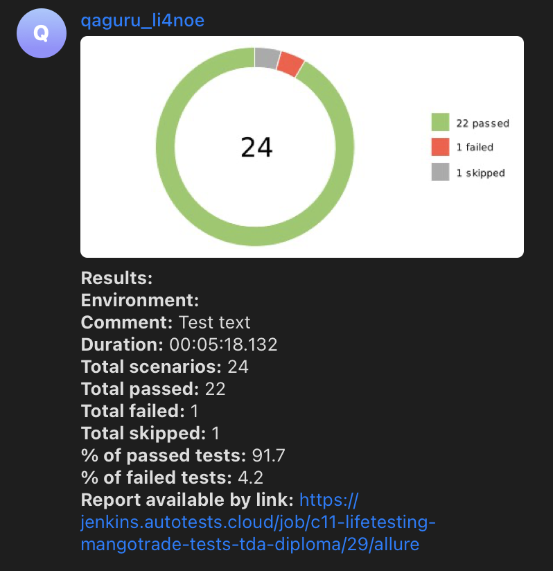

<a href="https://mangotrade.com"></a>

# Automation project for [MangoTrade.com](mangotrade.com)
## :bulb: Content:

- [Implemented automated checks](#white_check_mark-Implemented-automated-checks)
- [Scheduled to automate checks](#soon-Scheduled-to-automate-checks)
- [Technology stack](#gear-Technology-stack)
- [Tests launch from Terminal](#Tests-launch-from-Terminal)
- [Tests launch from Jenkins](#-Tests-launch-from-Jenkins#)
- [Tests results report in Allure Report](#-Tests-results-report-in-Allure-Report)
- [Allure TestOps integration](#-Allure-TestOps-integration)
- [Jira integration](#-Jira-integration)
- [Telegram notifications using a bot](#-Telegram-notifications-using-a-bot)
- [Example of test execution in Selenoid](#-Example-of-test-execution-in-Selenoid)
___

## :white_check_mark: Implemented automated checks
- [x] UI Tests -> Validation of registration form
- [x] API Tests -> Sing in
- [x] API Tests -> User profile

## :gear: Technology stack
<p align="center">
<a href="https://www.jetbrains.com/idea/"></a>
<a href="https://www.java.com/"></a>
<a href="https://github.com/"></a>
<a href="https://junit.org/junit5/"></a>
<a href="https://gradle.org/"></a>
<a href="https://selenide.org/"></a>
<a href="https://aerokube.com/selenoid/"></a>
<a href="https://github.com/allure-framework/allure2"></a>
<a href="https://qameta.io/"></a>
<a href="https://www.jenkins.io/"></a>
<a href="https://telegram.org/?setln=en/"></a>
<a href="https://rest-assured.io/"></a>
<a href="https://projectlombok.org/"></a>
</p>

Current project is developing and it contains autotests written by <code>Java</code> with using <code>Selenide</code> for UI-tests.
>
> <code>Selenoid</code> executes browsers launch in containers <code>Docker</code>.
>
> <code>Allure Report</code> and <code>Allure TestOps</code> generate reports and graphs about tests launch,
> also they enable possibility to store and to track manual tests, which will be automated in the future.
>
> <code>Gradle</code> is used for automated project builds.
>
> <code>JUnit 5</code> is used as unit test library.
>
> <code>Jenkins</code> executes launch of tests.
> After ending the test run, notifications are sent by <code>Telegram</code> bot.
>
> <code>REST-assured</code> is used sending rest api request.
> 
##  Tests launch from Terminal

### :wrench: Local tests launch

```
gradle clean test
```

### :hammer_and_wrench:	 Remote tests launch

```
clean
${TASK}
-Dproperties=remote
```

### :clipboard:	 Build settings

> <code>TASK</code> – tag that allows to run tests separately:
> 
>test - all tests
> 
>ui - ui tests
> 
> rest_api - api tests
>
> <code>-Dproperties=remote</code> - config file, which will be created when tests launch will be started.

### :clipboard:	 Config file structure

```
remoteDriverUrl=https://${REMOTE_DRIVER_USER}:${REMOTE_DRIVER_PASS}@${REMOTE_DRIVER_URL}/wd/hub/
videoStorage=https://${REMOTE_DRIVER_URL}/video/
browser=${BROWSER}
browser.size=${BROWSER_SIZE}
browser.version=${BROWSER_VERSION}
baseurl=https://trade.mangotrade.com
restbaseurl=https://auth.trade.mangotrade.com
```

> This config file contains next setting values:
> 
> <code>REMOTE_DRIVER_URL</code> – remote server address, where tests will be launched.
> 
> <code>REMOTE_DRIVER_USER, REMOTE_DRIVER_PASS</code> - credits for remote server.
>
> <code>BROWSER</code> – browser, where tests will be executed (_default value: <code>chrome</code>_).
>
> <code>BROWSER_VERSION</code> – browser version, where tests will be executed (_default value: <code>91.0</code>_).
>
> <code>BROWSER_SIZE</code> – window size of browser, where tests wil be executed (_default value: <code>1920x1080</code>_).
> 
> <code>THREADS</code> - this setting gives possibility to launch specified number of tests in parallel.

___
##  Tests launch from [Jenkins](https://jenkins.autotests.cloud/job/c11-lifetesting-mangotrade-tests-tda-diploma/)
*For launch remote tests it's necessary to click the option <code><strong>*Собрать с параметрами*</strong></code>, then to fill build settings and to click the button <code><strong>*Собрать*</strong></code>.*
<p align="center">
  
</p>

*After tests execution, in the panel <code><strong>*История сборок*</strong></code> in the row with build number
icons <code><strong>*Allure Report*</strong></code>
and <code><strong>*Allure TestOps*</strong></code> will appear.*

*Icon <code><strong>*Allure Report*</strong></code> opens 
html-report in Allure Report.*

*Icon <code><strong>*Allure TestOps*</strong></code> opens
html-report in Allure TestOps.*

<p align="center">
  
</p>

##  Tests results report in [Allure Report](https://jenkins.autotests.cloud/job/c11-lifetesting-mangotrade-tests-tda-diploma/29/allure/)

### :pushpin: Common information

*Allure report main page contains next information blocks:* 
> - [x] <code><strong>*ALLURE REPORT*</strong></code> -  date and time of tests launch, total number of executed cases and the diagram with indication of percentage and number of successful, failed and broken tests
>- [x] <code><strong>*TREND*</strong></code> - displays trend of passing tests from one build to another
>- [x] <code><strong>*SUITES*</strong></code> - displays the distribution of tests results by tests suites
>- [x] <code><strong>*ENVIRONMENT*</strong></code> - displays test environment where tests were launched
>- [x] <code><strong>*CATEGORIES*</strong></code> - displays the distribution of failed tests by types of defects
>- [x] <code><strong>*FEATURES BY STORIES*</strong></code> - displays the distribution of tests by functionality, which they check
>- [x] <code><strong>*EXECUTORS*</strong></code> - displays the executor of the current build (link to Jenkins build)

<p align="center">
  
</p>

##  [Allure TestOps](https://allure.autotests.cloud/launch/13104) integration

### :pushpin: Overview dashboard

<p align="center">
  
</p>

### :pushpin: Test cases

<p align="center">
  
</p>

### :pushpin: Test launch from Allure TestOPS -> [Test Plan](https://allure.autotests.cloud/testplan/317/)

<p align="center">
  
</p>

##  [Jira](https://jira.autotests.cloud/browse/AUTO-810) integration

<p align="center">
  
</p>

##  Telegram notifications using a bot

 > After the test run is completed, created <code>Telegram</code>-bot automatically handles and sends a message with a test run report.   

<p align="center">

</p>

##  Example of test execution in Selenoid

> A video is attached to each test in the report.


https://user-images.githubusercontent.com/84909251/170703690-2429aad9-d5cd-486d-a489-aaeb91f43240.mp4


